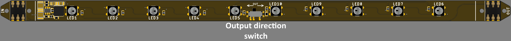
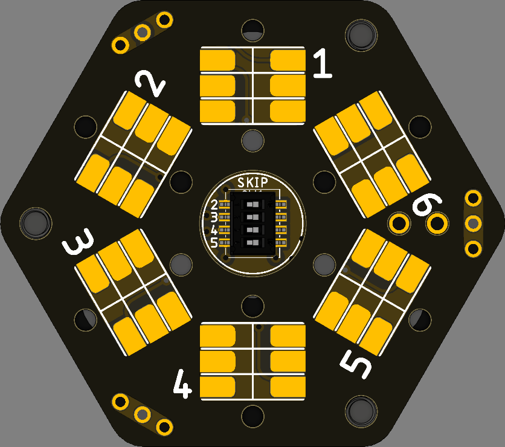
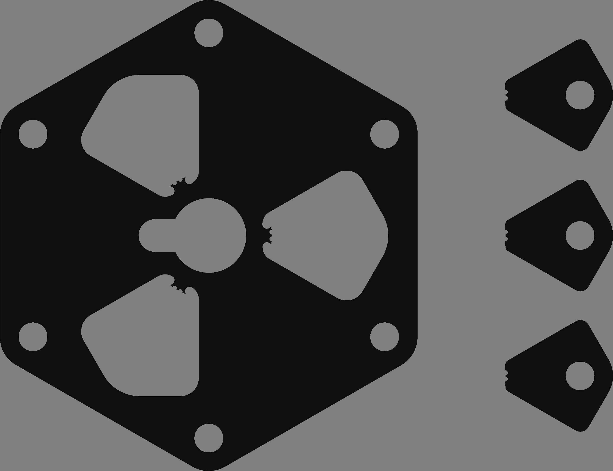

# Esagono
Esagono is a set of devices intended to create scalable light installations based on equilateral triangles and regular hexagons. 

From the logical point of view Esagono installation can be considered as and addressable led strip. Esagono features:

* Solderless assembly.
* Open source controller firmware.
* Scalability enables creating of really BIG installations.
* Data line commutation means enables almost arbitrary configurations.

Esagono installation consistis of three types of devices:

* Light strips. Quantity depends on the selected configuration.
* Nodes. Quantity depends on the selected configuration.
* Master node. Usually only one needed.

## Light strip

Light strip is the main active device of the installation. Each light strip hosts 10 addressable WS2812b of compatible LEDs. It should be noted that the order of connection of the LEDs is not as straightforward as it might seem. The real order is 1, 2, 3, 4, 5, 10, 9, 8, 7, 6 (just as it is in the picture above). 

Each light strip has two spring connectors: input and output connectors. The data input of the first LED is connected to the input connector data pin. However, data output of the last LED can be routed to both ends of the light strip using the switch placed in the middle of the strip. This is one of the data commutating means that ebables arbitrary configurations of the whole installation. 

## Node

	

Nodes are intended to mechanical and electrical connection of the light strips as well as provide commutation of the data line. Each node has six connectors for light strips that are called ports. Each port can act as an input and output for the data line. Each port's output pin is connected to the next port's input pin (except ports 1 and 6).
In general, if all the ports of the node are used and all the led strips are configured to direct the data line back to the node they start, the data line path looks as follows: 1->2->3->4->5->6. It should be kept in mind that the data path in the node is not put in a loop and the output of the port 6 is not connected anywhere. In case if one of the port has no light strip connected to it the data line path breaks. To prevent this each node contains a dip switch (see the picture below) that allows the data line to bypass the port with absent light strip and direct it to the next port.

	

Structurally the node consists of following components:

* The node PCB without any components mounted excluding the dip switch
* The spacer
* Front panel
* Three ornately shaped washers. These are initially embedded into the back panel and should be first detached (see the picture below).
* Back panel
* Three nylon M3 standoffs
* Six ISO7380 8 mm M3 screws

	

When assembling the nodes the front panel should not be installed. Instead the front panels should be screwed in place after the complete assembly of the whole installation and its testing. 

## Master node

The master node is the node at which the the the light strip starts. It also hosts the controller. Structurally master node is the same as regular node with following exceptions:

* The node pcb has all its components populated (i.e. the power connector, power reverse polarity protection circuit and pinheader connectors).
* The controller PCB is connected.

	

